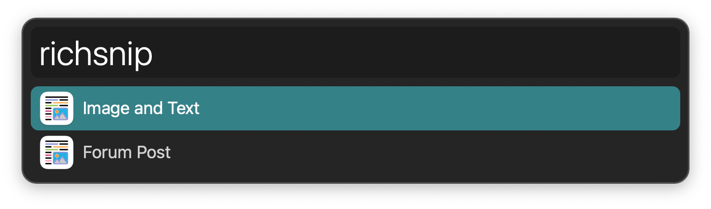
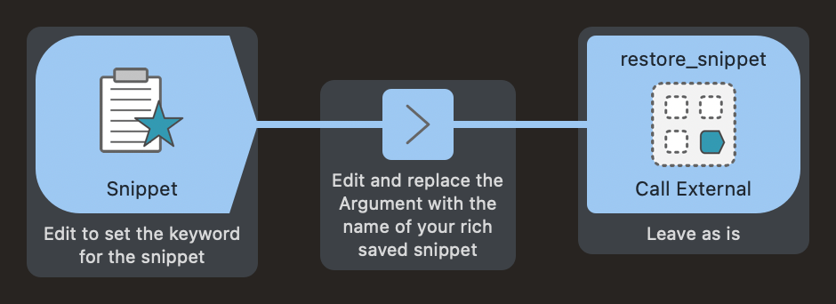

#  Rich Snippets Alfred Workflow

Save and search rich snippets

[⤓ Install on the Alfred Gallery](https://alfred.app/workflows/alfredapp/rich-snippets)

## Usage

Copy rich text, images, and other special data from the clipboard with the `richsave` keyword followed by your snippet name.

Restore a snippet to the clipboard and paste it to the frontmost app with the `richsnip` keyword. Use <kbd>⌘</kbd><kbd>↩&#xFE0E;</kbd> to delete a snippet.

Configure the [Hotkeys](https://www.alfredapp.com/help/workflows/triggers/hotkey/) for faster triggering.

### Triggering Like Regular Snippets

You can paste rich snippets like the others by creating a new workflow with a [Snippet Trigger](https://www.alfredapp.com/help/workflows/triggers/snippet/). Connect it to an [Arg and Vars Utility](https://www.alfredapp.com/help/workflows/utilities/argument/) with the name of the snippet as the Argument. Finally, connect it to a [Call External Trigger Output](https://www.alfredapp.com/help/workflows/outputs/call-external-trigger/) referencing `restore_snippet` in this workflow.

There is an example you can copy at the bottom of the Workflow canvas.

